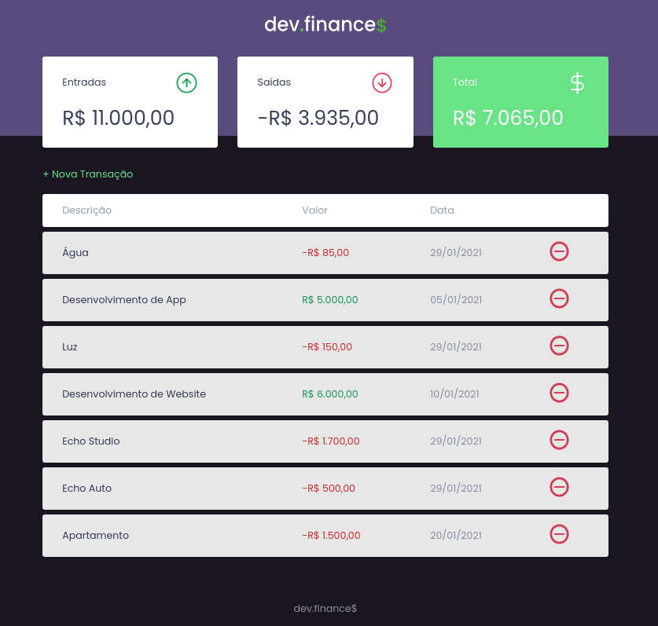

<h1 align="center">
    
</h1>

  <a href="#tecnologias">Tecnologias</a>&nbsp;&nbsp;&nbsp;|&nbsp;&nbsp;&nbsp;
  <a href="#-projeto">Projeto</a>&nbsp;&nbsp;&nbsp;|&nbsp;&nbsp;&nbsp;
  <a href="#-demo">Demo</a>&nbsp;&nbsp;&nbsp;|&nbsp;&nbsp;&nbsp;
  <a href="#-layout">Layout</a>&nbsp;&nbsp;&nbsp;|&nbsp;&nbsp;&nbsp;
  <a href="#memo-licença">Licença</a>
  

    
  
       

   

 

  

## 🚀 Tecnologias

- [HTML](#)
- [CSS](#)
- [JavaScript](#)

## 💻 Demo

Acesse a demo do site através deste link:

* [Clique aqui](https://devfinances-ten.vercel.app/)
## 💻 Projeto

Facilitando a sua vida financeira 💰

* Este é um projeto desenvolvido durante a **[MaratonaDiscover](https://maratonadiscover.rocketseat.com.br/)**, realizada pela **[@Rocketseat](https://github.com/Rocketseat)**.

## 🔖 Layout

Você pode visualizar o layout do projeto através do link abaixo:

- [Layout](https://www.figma.com/file/JEfgGN7089jLXga5T9hBXt/dev.finance-Maratona-Discover-Copy) 

Lembrando que você precisa ter uma conta no [Figma](http://figma.com/) para acessá-lo.

## 📝 Licença

Esse projeto está sob a licença MIT. Veja o arquivo [LICENSE](LICENSE.md) para mais detalhes.

---

Desenvolvido com 💜 por birobirobiro

